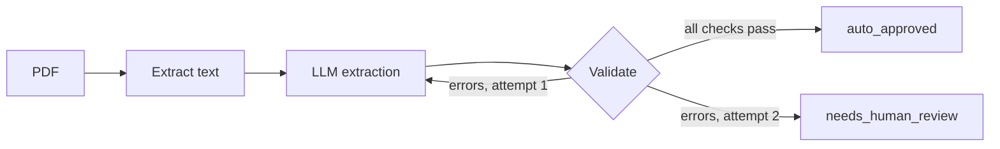

# doc-agent

An invoice-processing agent that **knows when not to trust itself**.

It extracts fields from invoice PDFs with an LLM, validates them with deterministic rules, retries once with feedback, and sends anything still doubtful to a human instead of guessing.

Built with Python, LangGraph and an OpenAI-compatible LLM client (Gemini by default, Ollama as an offline fallback).

## How it works



The LLM is one step; code controls the flow. Validation checks:

- `total_ht + tva = total_ttc` (tolerance 0.05)
- the ICE (Moroccan company ID) has exactly 15 digits
- the invoice number is present
- **grounding:** every extracted ICE, invoice number and amount must actually appear in the PDF text

On retry, the validator's errors are sent back to the model. If the invoice itself is faulty, the agent must report what is printed, so it ends in `needs_human_review` instead of being silently "corrected".

## Results

Evaluated on 12 synthetic Moroccan B2B invoices (8 French, 4 English, 3 layouts), 3 of them deliberately faulty (wrong total, 14-digit ICE, missing invoice number). Model: `gemini-3.8-flash`.

| Version | Field accuracy | Faulty invoices routed to review | Auto-approved |
|---|---|---|---|
| v1 | 97.92% (94/96) | 1/3 | 91.67% |
| v1.2 | 100% (96/96) | 3/3 | 75% (9/12) |

**What changed between v1 and v1.2:** in v1 the retry step let the model "fix" faulty invoices: it recomputed a total and invented a valid-looking ICE, so two faulty invoices were auto-approved with fabricated data. v1.2 fixes this with a stricter prompt ("copy exactly as printed, never correct") and the grounding check above. The auto-approved rate dropped because the two wrongly approved invoices are now correctly flagged.

**Limits:** the test set is small and synthetic, written together with the validation rules. Treat the numbers as a regression baseline, not a production claim.

## Run it

```bash
git clone https://github.com/Acherouid/doc-agent.git
cd doc-agent
python -m venv .venv && source .venv/bin/activate
pip install -r requirements.txt

cp .env.example .env        # then fill in LLM_API_KEY and LLM_MODEL
python agent.py data/invoices/invoice_01_atlas_fournitures_industrielles_sarl.pdf
python eval.py              # full evaluation, saves results/eval_v1.json
python eval.py --out results/my_run.json --delay 8
```

`.env` uses any OpenAI-compatible endpoint:

```
LLM_BASE_URL=https://generativelanguage.googleapis.com/v1beta/openai/
LLM_API_KEY=your_key_here
LLM_MODEL=your_model_name
# Offline fallback with Ollama:
# LLM_BASE_URL=http://localhost:11434/v1
# LLM_API_KEY=ollama
# LLM_MODEL=qwen2.5:7b
```

To regenerate the sample invoices and ground truth: `python generate_invoices.py` (requires `reportlab`).

## Repository layout

```
agent.py                 LangGraph agent: extract -> validate -> retry -> approve/review
eval.py                  Evaluation against data/ground_truth.json
generate_invoices.py     Synthetic invoice and ground-truth generator
data/invoices/           12 sample PDFs
data/ground_truth.json   Expected fields and faulty-invoice flags
results/                 Saved evaluation runs
```

## Roadmap

- Streamlit demo with a human review screen
- Async batch processing with timing
- OCR for scanned PDFs (Tesseract `fra+ara` or a vision model)
- Larger, real-world (anonymized) evaluation set
- Audit log and job queue for production use

## License

MIT
